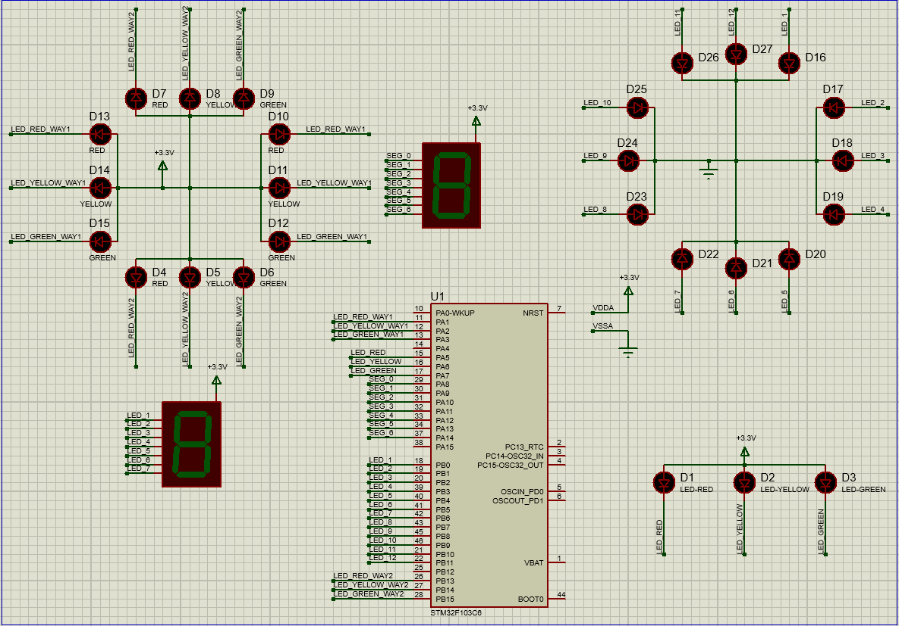

# MICROCONTROLLER - MICROPROCESSOR, LABORATORY 1

This is the first lab to get familiar with GPIO (General Purpose Input/Output) through a variety of exercises focused on LED Animations.


## 1. Schematic for this lab

I simulated the source code on an STM32F103C6 using Proteus 8. The schematic looks like this:



The pin assignments are listed in the table below:

| PIN      | PIN LABEL      | FOR EXERCISE                   |
|:---------|:---------------|:------------------------------:|
| PA1      | LED_RED_WAY1   | `-\|-\|3\|-\|5\|-\|-\|-\|-\|-` |
| PA2      | LED_YELLOW_WAY1| `-\|-\|3\|-\|5\|-\|-\|-\|-\|-` |
| PA3      | LED_GREEN_WAY1 | `-\|-\|3\|-\|5\|-\|-\|-\|-\|-` |
| PA4      | not in use     | `-\|-\|-\|-\|-\|-\|-\|-\|-\|-` |
| PA5      | LED_RED        | `1\|2\|-\|-\|-\|-\|-\|-\|-\|-` |
| PA6      | LED_YELLOW     | `1\|2\|-\|-\|-\|-\|-\|-\|-\|-` |
| PA7      | LED_GREEN      | `-\|2\|-\|-\|-\|-\|-\|-\|-\|-` |
| PA8      | SEG_0          | `-\|-\|-\|4\|5\|-\|-\|-\|-\|-` |
| PA9      | SEG_1          | `-\|-\|-\|4\|5\|-\|-\|-\|-\|-` |
| PA10     | SEG_2          | `-\|-\|-\|4\|5\|-\|-\|-\|-\|-` |
| PA11     | SEG_3          | `-\|-\|-\|4\|5\|-\|-\|-\|-\|-` |
| PA12     | SEG_4          | `-\|-\|-\|4\|5\|-\|-\|-\|-\|-` |
| PA13     | SEG_5          | `-\|-\|-\|4\|5\|-\|-\|-\|-\|-` |
| PA14     | SEG_6          | `-\|-\|-\|4\|5\|-\|-\|-\|-\|-` |
| PA15     | not in use     | `-\|-\|-\|-\|-\|-\|-\|-\|-\|-` |
| PB0      | LED_1          | `-\|-\|-\|-\|-\|6\|7\|8\|9\|10` |
| PB1      | LED_2          | `-\|-\|-\|-\|-\|6\|7\|8\|9\|10` |
| PB2      | LED_3          | `-\|-\|-\|-\|-\|6\|7\|8\|9\|10` |
| PB3      | LED_4          | `-\|-\|-\|-\|-\|6\|7\|8\|9\|10` |
| PB4      | LED_5          | `-\|-\|-\|-\|-\|6\|7\|8\|9\|10` |
| PB5      | LED_6          | `-\|-\|-\|-\|-\|6\|7\|8\|9\|10` |
| PB6      | LED_7          | `-\|-\|-\|-\|-\|6\|7\|8\|9\|10` |
| PB7      | LED_8          | `-\|-\|-\|-\|-\|6\|7\|8\|9\|10` |
| PB8      | LED_9          | `-\|-\|-\|-\|-\|6\|7\|8\|9\|10` |
| PB9      | LED_10         | `-\|-\|-\|-\|-\|6\|7\|8\|9\|10` |
| PB10     | LED_11         | `-\|-\|-\|-\|-\|6\|7\|8\|9\|10` |
| PB11     | LED_12         | `-\|-\|-\|-\|-\|6\|7\|8\|9\|10` |
| PB12     | not in use     | `-\|-\|-\|-\|-\|-\|-\|-\|-\|-` |
| PB13     | LED_RED_WAY2   | `-\|-\|3\|-\|5\|-\|-\|-\|-\|-` |
| PB14     | LED_YELLOW_WAY2| `-\|-\|3\|-\|5\|-\|-\|-\|-\|-` |
| PB15     | LED_GREEN_WAY2 | `-\|-\|3\|-\|5\|-\|-\|-\|-\|-` |

## 2. How to run the exercises source code?

Each exercises is implemented in separeta source file (.c) and header file (.h), which are placed in `./Core/Src/` and `./Core/Inc/` respectively. I recommend 2 ways to run the code:

### 2.1. Clone this Project and Run:
If you clone this project to your local device, you only need to change `RUN_EXERCISE` in `./Core/Src/main.c` to the exercise number you want to run (from `1` to `10`).

```c
#define RUN_EXERCISE 10
```

### 2.2. Download specific exercise file:
1. Ensure that all hardware connections are correct as described above.

2. Download the header and source files for the specific exercise you want to run, place them in the appropriate directories, and include the header in `./Core/Src/main.c` as follows:
```c
#include "exercise-.h"
```

3. Run the code. Each exercises has two main functions: `exercise-_init()` ensure all necessary pins are available; and `exercise-_run()` to execute the exercise requirements.. You should place these functions within the `while` loop in the `main()` function.